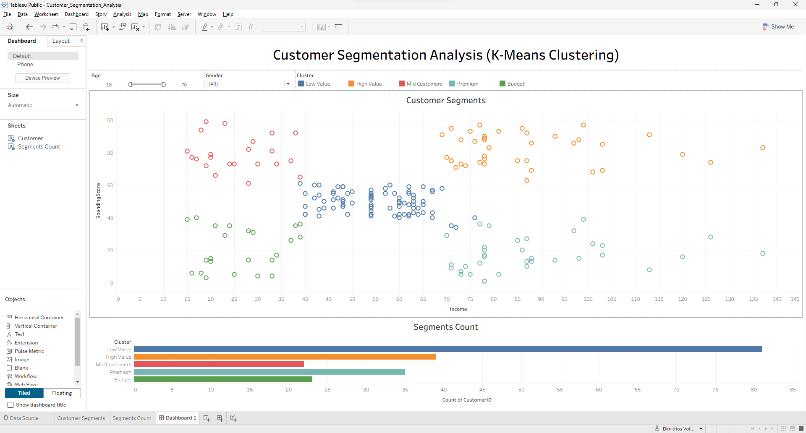
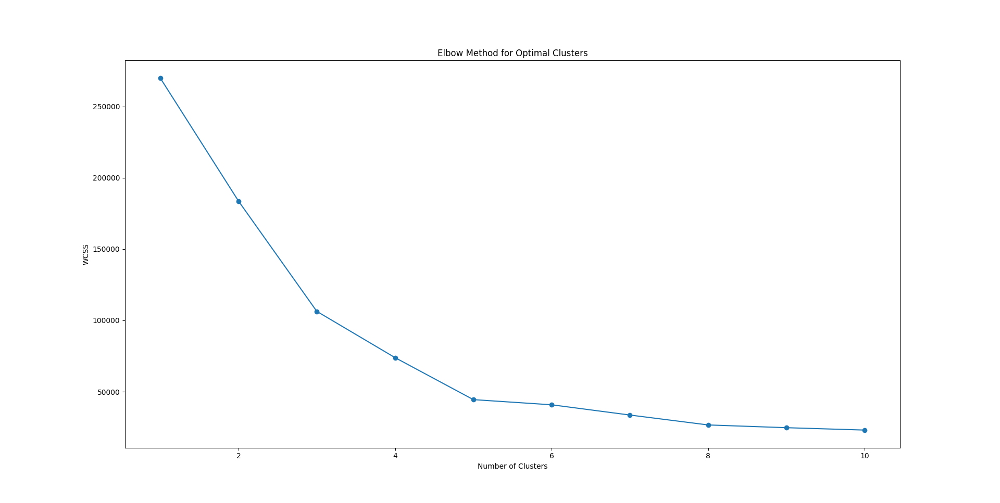

# 🛒 Customer Segmentation Analysis (K-Means Clustering)

## 📌 Project Overview
This project applies **Unsupervised Machine Learning** to segment a customer base into distinct groups. By analyzing annual income and spending patterns, businesses can develop targeted marketing strategies based on specific customer behaviors.

## 🎯 Objective
To identify **5 strategic customer segments** using the **K-Means Clustering** algorithm and the **Elbow Method** for optimal cluster selection.

## 🛠 Tools & Technologies
- **Python** (Pandas, Matplotlib, Scikit-learn)
- **Tableau** (Interactive Dashboarding)
- **Machine Learning:** K-Means Clustering & Elbow Method

## 📊 Process & Methodology
1. **Data Ingestion:** Loaded raw customer data into Python for pre-processing and cleaning.
2. **Statistical Analysis:** Used the **Elbow Method** (WCSS) to determine the optimal number of clusters (k=5).
3. **ML Modeling:** Applied **K-Means** to assign segment IDs based on Annual Income and Spending Score.
4. **Data Export:** Processed data with cluster labels exported for BI visualization in Tableau.

## 📈 Identified Customer Segments
- 💎 **Premium:** High Income & High Spending.
- 💰 **Budget:** High Income & Low Spending (Opportunity for conversion).
- ⚖️ **Regular:** Average Income & Average Spending.
* 🛍️ **High Value:** Low Income & High Spending.
* 📉 **Low Spenders:** Low Income & Low Spending.

## 📷 Interactive Dashboard Preview

## 🔗 Interactive Dashboard
Explore the segments and data distributions in detail on Tableau Public:
👉 **[View Live Dashboard](https://public.tableau.com/views/Customer_Segmentation_Analysis_17739396103910/Dashboard1?:language=en-US&:sid=&:redirect=auth&:display_count=n&:origin=viz_share_link)**

## 🧠 Machine Learning Logic: Elbow Method

## 🚀 Skills Demonstrated
- **Machine Learning (Clustering)**
- **Feature Engineering**
- **Data Storytelling with Tableau**
- **Data Pre-processing with Python**
