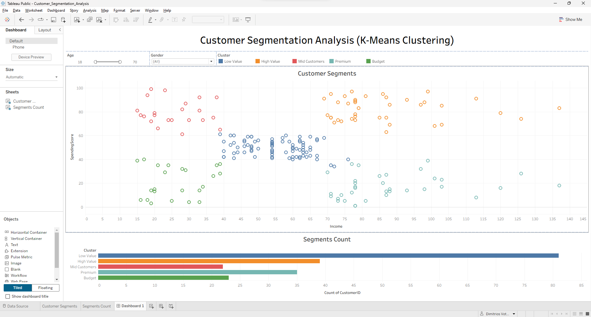
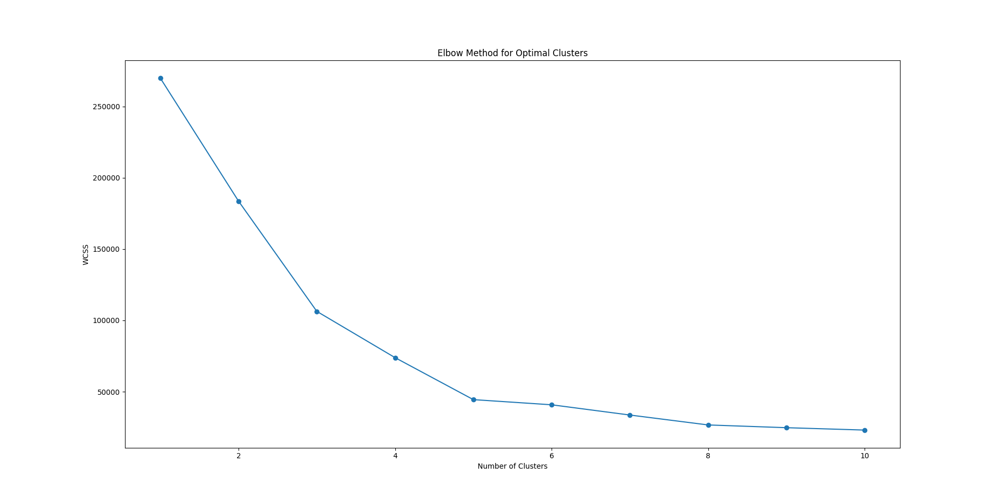

# 🛒 Customer Segmentation Analysis (K-Means Clustering)

## 📌 Project Overview
This project applies **Unsupervised Machine Learning** to segment a retail customer base into distinct, actionable groups. By mathematically clustering customers based on annual income and spending behaviors, businesses can transition from generic outreach to highly targeted, data-driven marketing campaigns.

## 🎯 Objectives
*   Discover hidden behavioral patterns within customer transaction attributes.
*   Determine the mathematically optimal number of segments using the **Elbow Method (WCSS Evaluation)**.
*   Implement an optimized **K-Means Clustering** algorithm to allocate segment identities.
*   Develop an interactive **Tableau Dashboard** to translate cluster properties into strategic business insights.

## 🛠 Tools & Technologies
*   **Language:** Python (Pandas, Matplotlib)
*   **Machine Learning:** Scikit-learn (`KMeans` & `k-means++` initialization)
*   **BI Visualization:** Tableau Desktop / Tableau Public
*   **Methodology:** Within-Cluster Sum of Squares (WCSS) & Feature Standardization Evaluation

## 📊 Methodology & Pipeline
1.  **Data Ingestion & Column Mapping:** Loaded raw attributes and standardized feature headers (`Income`, `SpendingScore`) to eliminate special character handling issues during modeling loops.
2.  **Hyperparameter Tuning (Optimal K):** Iterated through 1 to 10 potential clusters, calculating structural inertia (WCSS) at each step to map out the Elbow Curve.
3.  **Algorithmic Partitioning:** Executed the final K-Means model with **$K=5$**, appending clean categorical cluster markers directly back to the database.
4.  **Data Export Pipeline:** Structured and exported the multi-dimensional dataset into `cleaned_customers.csv` to serve as a high-performance live data source for Tableau.

## 🛠 Technical Decisions & Cluster Diagnostics
Clustering models require rigorous validation to guarantee that the generated segments reflect stable, real-world behaviors rather than algorithmic noise:

*   **Smart Initial Centroids (`init='k-means++'`):** Instead of picking random starting points—which can lead to unstable, sub-optimal clustering—I utilized `k-means++` to ensure the initial centroids were mathematically separated, maximizing model convergence stability.
*   **WCSS Intertia Interpretation:** The Elbow Method plot indicated a sharp stabilization in variance reduction at exactly 5 clusters, making it the clear choice for operational business segmentation.

## 📈 Actionable Marketing Strategies (Business Impact)
Instead of just viewing clusters as mathematical outputs, this pipeline maps each group directly to a core marketing playbook:
*   💎 **Premium Segment (High Income & High Spending):** Maintain high engagement through exclusive VIP loyalty perks, early product drops, and personalized concierge services.
*   💰 **Budget Segment (High Income & Low Spending):** Highly qualified leads but low engagement. Strategy: Target with premium value-proposition campaigns or product-use education to trigger conversion.
*   ⚖️ **Regular Segment (Average Income & Average Spending):** The baseline customer. Strategy: Implement standard cross-selling strategies and automated milestone discounts to raise lifetime value (LTV).
*   🛍️ **High Value Segment (Low Income & High Spending):** Highly brand-loyal but potentially price-sensitive. Strategy: Engage with flash sales, volume-based discounts, or free shipping incentives.
*   📉 **Low Spenders Segment (Low Income & Low Spending):** Low priority. Strategy: Move to low-cost automated email marketing sequences to minimize marketing ad-spend drain.

## 📷 Interactive Dashboard Preview
### Customer Segments Evaluation

## 🧠 Machine Learning Logic: Elbow Method

## 🔗 Interactive Dashboard
Explore the segments and data distributions in detail on Tableau Public:
👉 **[View Live Dashboard](https://public.tableau.com/views/Customer_Segmentation_Analysis_17739396103910/Dashboard1?:language=en-US&:sid=&:redirect=auth&:display_count=n&:origin=viz_share_link)**

## 🚀 Skills Demonstrated
*   **Unsupervised Machine Learning & Clustering**
*   **Hyperparameter Optimization** (WCSS & Centroid Tuning)
*   **Actionable Business Segmentation Strategy**
*   **Data Storytelling** (Tableau Dashboard Design)
